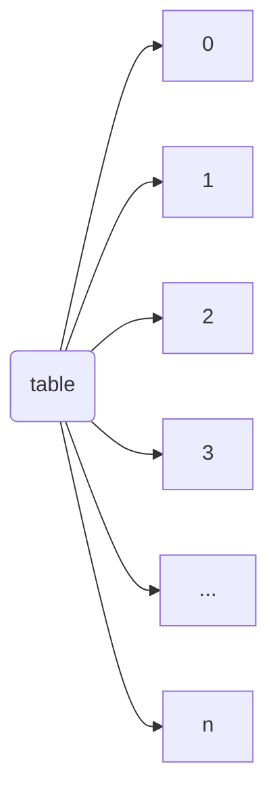

# Assumption 

In modern society, most distributions follow Pareto rules (power law, Zipf law).

Therefore I set the Zipf distribution as an experimental group distribution and uniform distribution as a control group.

# Environment 

Processor: 2 x Intel(R) Xeon(R) CPU E5-2630 v4 @ 2.20GHz

Configuration: 20 Cores

Hyperthreading: disabled

Main Memory: 256GB

Operating System: Ubuntu 20.04.4 LTS 

# Problem definition

Used Linux performance evaluation tool "Perf", Zipf distribution (alpha=1.5).

Set insert as a multi-value insertion to mimic an update operation.

(update operation updates from the old value to the new value, so I thought that appending another value to the existing key could make update-like overhead)

### Uniform distribution

Samples: 14K of event 'cycles', Event count (approx.): 6,652,138,668

| Field                       | Output                |
| --------------------------- | --------------------- |
| 0.25M Insert()              | 160.758036 (ms)       |
| write throughput            | 1723391.295972 (op/s) |
| successful write throughput | 1630786.283057 (op/s) |
| 0.25M Get()                 | 481.630493 (ms)       |
| avg read latency            | 0.001837 (ms)         |
| key num                     | 262144                |
| main success cnt            | 262162                |
| insert trial cnt            | 279234                |
| insert success cnt          | 262162                |
| insert fail cnt             | 2231                  |

the Insertion operation ratio was 45.97% for the event count around 6B.

In the Insertion operation Traverse function was the most frequently called function.

### Skewed distribution 

Samples: 7M of event 'cycles', Event count (approx.): 4284,866,686,233

| Field                       | Output             |
| --------------------------- | ------------------ |
| 0.25M Insert()              | 104848.458447 (ms) |
| write throughput            | 2754.728150 (op/s) |
| successful write throughput | 2500.399185 (op/s) |
| 0.25M Get()                 | 422.648142 (ms)    |
| avg read latency            | 0.001612 (ms)      |
| key num                     | 262144             |
| main success cnt            | 262163             |
| insert trial cnt            | 1821601            |
| insert success cnt          | 262163             |
| insert fail cnt             | 1532773            |

the Insertion operation ratio was 94.76% for the event count around 4284B.

Likewise, the Traverse function was the most frequently called function; it took 94.75% out of 94.76%.

We can observe that fail cnt is increased hugely compare to the uniform dist. one.

it's because the Skewed distribution increased the possibility of an update operation to the same key-value pair which resulted in the CAS operation failure and traversed again.

### perf c2c performance evaluation

|  |  |
| :----------------------------------------------------------: | :----------------------------------------------------------: |
|                           Uniform                            |                            Skewed                            |

LLC Misses to Remote cache (HITM) means hitting in a remote modified cache in other cores.

It is false sharing that results in a cache invalidation storm.

When we insert the same number of keys into each distribution, the absolute number of LLC Misses to the remote cache differs a lot.

Uniform distribution was missed 140 times while skewed one was missed 22761 times.

I concluded that reducing a single Traverse function call time(from invocation to return) and a number of Traverse function calls can make performance improvement.

Furthermore, reducing false sharing could make another performance improvement.

# Design 1: node-based mapping table

Because the mapping table is an adjacent continuous array, we can improve it by introducing a node-based mapping table to reduce the false sharing contention effect.

In the original implementation, false sharing occurred because the array address was adjacent; addresses were embedded into one single cache line.

We can improve it by adding cache padding between array elements or making it into a dynamically allocated node so that address can be disjoint.

Like we improved from Anderson Queue lock to CLH lock, I chose to make it with a node because if we introduce cache padding there will be huge space consumption.

By using design 1, we can reduce the false sharing problem I mentioned in the problem section.

### *MODIFIED DESIGN 1: OFFSET TABLE*

I found that there could be another possibility that the dynamically allocated node could have an adjacent address in the heap memory area.

So I introduce another solution to avoid false sharing.

From the small experiment, I found that Zipf distribution mostly gives us low decimal values so it mostly accesses the low logical address (e.g. in the mapping table, index 0 is the most accessed, index 1 is the next, index 2 is the next.. so on.)

With this fact, I introduce another solution the index-offsetted table.

The index-offsetted table reorders logical addresses so that low logical addresses can be disjoint.

Each original low address will reside in different cache lines so that it can reduce false sharing.

# Design 2: LRU cache

Inspired by TTAS lock, We can reduce the Traverse function call time(from invocation to return) with LRU cache.

This is how the LRU cache works.

Every thread has its own LRU cache as a local thread variable. This is to reduce another cache invalidation storm. if we make a single shared LRU cache, it could make another update contention.

Insert operation looks up the table like the read phase in TTAS lock, and it will perform the following downstream tasks like the write phase in TTAS lock.

The cache consist of the logical address of the given key, and key value.

- LRU cache example

If the insert operation is performed it will look up the LRU cache and try to find the given key.
If the given key does not exist on the cache then it will traverse and find the target node.

Once it found the target, it updates the cache with the target's logical address and key before finishing the insert operation.

In the other scenario, let's say that the insertion operation successfully found the target from the cache with the given key.

Now the insertion operation can have the logical address of the key and can try to find the key by following the mapping table entry with the logical address.

If the key exists in the node, it will update that key

If the key not exists, it will traverse the tree and will update the cache.

It can reduce the single traverse time of the insertion operation I mentioned in the problem section.

# Design 3: postponed update

Perform the batch update with the same key.

Because random numbers drawn from skewed distribution in a row are likely to be the same numbers if we batch the update for the same number and just perform one single traverse. we can successfully reduce the total number of traverse function calls.

By introducing lock based set in which the critical section is small, we can batch the operations in one piece.

We can make one single shared batch set and make a dedicated thread to process it.
Or like we did in the LRU cache, make the batch for each thread and process it with each thread so that we can avoid contention.

If we choose the former one we can process a large batch with a single traverse compared to the latter one but we may face small contention.
If we choose the latter one we will process a small batch with a single traverse compared to the former one but the number of batch operations will be increased.

The update period can vary(i.e. 1ms, 40ms, 40ops ...), it will be determined later with experiments after implementation.

### lock mechanism 
Let's say that we chose one single shared batch design. When we can't find an element with the given key, we acquire a lock to the whole set. if the element already exists so that we can find it with the given key, we acquire a lock to the target set element.

# Reference

Power law. (2022, November 5). In *Wikipedia*. https://en.wikipedia.org/wiki/Power_law
